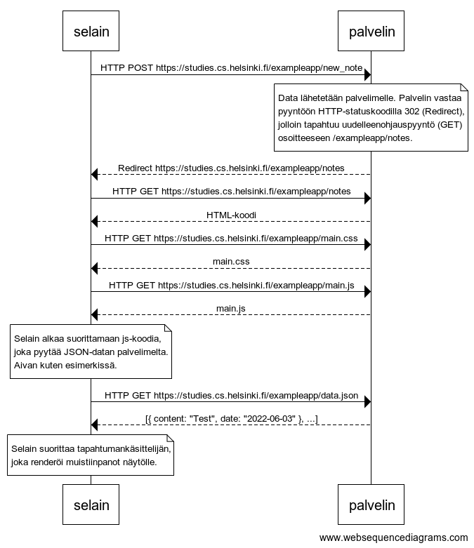
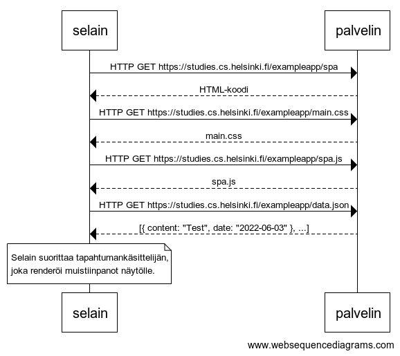
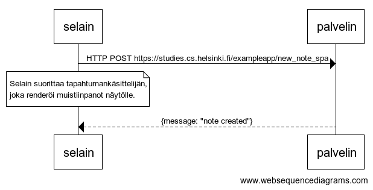

# Johdanto

Alapuolella kukin tehtävä, sen tehtävänanto ja palautus.

### <ins>**Harjoitus 0.4 - uusi muistiinpano**</ins>

Luvussa JavaScriptia sisältävän sivun lataaminen - kertaus kuvataan sekvenssikaavion avulla sivun https://studies.cs.helsinki.fi/exampleapp/notes avaamisen aikaansaama tapahtumasarja.

Tee vastaavanlainen kaavio, joka kuvaa mitä tapahtuu tilanteessa, missä käyttäjä luo uuden muistiinpanon ollessaan sivulla https://studies.cs.helsinki.fi/exampleapp/notes, eli kirjoittaa tekstikenttään jotain ja painaa nappia tallenna.

Kirjoita tarvittaessa palvelimella tai selaimessa tapahtuvat operaatiot sopivina kommentteina kaavion sekaan.

Kaavion ei ole pakko olla sekvenssikaavio. Mikä tahansa järkevä kuvaustapa käy.

Kaikki oleellinen tieto tämän ja seuraavien kahden tehtävän tekemiseen on tässä osassa. Näiden tehtävien ideana on, että luet tekstin vielä kerran ja mietit tarkkaan mitä missäkin tapahtuu. Ohjelman koodin lukemista ei näissä tehtävissä edellytetä, vaikka sekin on toki mahdollista.

### <ins>**Harjoitus 0.5 - Single Page App**<ins>

Tee kaavio tilanteesta, jossa käyttäjä menee selaimella osoitteeseen https://studies.cs.helsinki.fi/exampleapp/spa eli muistiinpanojen Single Page App-versioon

### <ins>**Harjoitus 0.6 - Uusi muistiinpano**<ins>

0.6: Uusi muistiinpano
Tee kaavio tilanteesta, jossa käyttäjä luo uuden muistiinpanon single page -versiossa.

Tämä oli osan viimeinen tehtävä ja on aika pushata vastaukset GitHubiin sekä merkata tehdyt tehtävät palautussovellukseen.

